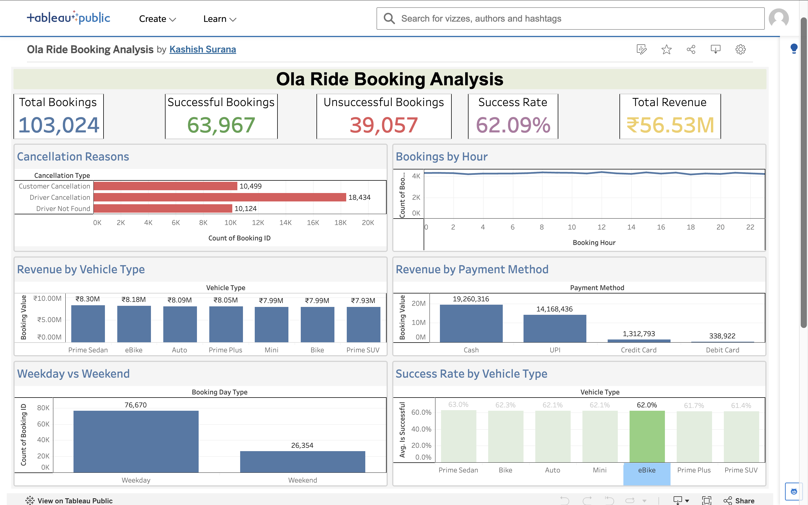

# 🚕 Ola Ride Booking Analysis

An end-to-end **data analytics project** analyzing **103,024 Ola ride bookings** to identify booking performance, revenue trends, vehicle performance, cancellation patterns, customer behavior, and operational insights.

The project uses **Python, SQL, and Tableau Public** to transform raw booking data into actionable business insights.

---

## 📊 Dashboard Preview



### 🔗 Interactive Dashboard

[View Interactive Tableau Dashboard](https://public.tableau.com/app/profile/kashish.surana/viz/OlaRideBookingAnalysis/Dashboard1?utm_source=chatgpt.com)

---

## 🎯 Project Objectives

* Analyze overall booking success and failure rates
* Identify major cancellation reasons
* Compare vehicle types based on revenue and success rate
* Analyze booking patterns by hour and day type
* Understand payment method and revenue distribution
* Identify high-demand pickup and drop locations
* Generate business insights from ride-booking data

---

## 🛠️ Tech Stack

* **Python** — Data cleaning and exploratory data analysis
* **Pandas** — Data manipulation
* **MySQL** — SQL-based business analysis
* **Tableau Public** — Interactive dashboard and visualization
* **Git & GitHub** — Version control

---

## 📈 Key Metrics

| Metric                |      Result |
| --------------------- | ----------: |
| Total Bookings        | **103,024** |
| Successful Bookings   |  **63,967** |
| Unsuccessful Bookings |  **39,057** |
| Success Rate          |  **62.09%** |
| Total Booking Value   | **₹56.53M** |
| Average Booking Value | **₹548.75** |

---

## 🔍 Key Analysis

The project covers:

* Overall Booking Performance
* Booking Status Analysis
* Revenue by Vehicle Type
* Success Rate by Vehicle Type
* Customer Cancellation Analysis
* Driver Cancellation Analysis
* Incomplete Ride Analysis
* Bookings by Hour
* Weekday vs Weekend Analysis
* Payment Method Analysis
* Pickup & Drop Location Analysis
* Average Ride Distance
* Average Booking Value
* Driver & Customer Ratings

---

## 💡 Key Business Insights

* The overall booking success rate is **62.09%**, while **37.91%** of bookings are unsuccessful.
* **Driver cancellations (17.89%)** are the largest unsuccessful booking category.
* **Prime Sedan** generates the highest revenue among vehicle types at approximately **₹8.30M**.
* Prime Sedan also has the highest vehicle-level success rate at **63.04%**.
* The most common customer cancellation reason is **the driver not moving towards the pickup location**.
* **Weekdays account for 74.42%** of total bookings.
* **Cash** is the most frequently used payment method and contributes the highest revenue.
* **Customer demand** and **vehicle breakdowns** are the leading reasons for incomplete rides.

---

## 📁 Project Structure

```text
Ola_Data_Analytics/
│
├── Bookings.csv
├── Bookings_Cleaned.csv
├── analysis.py
├── sql_analysis.sql
├── dashboard.png
├── README.md
└── .gitignore
```

---

## ▶️ How to Run

### Python Analysis

Create and activate a virtual environment:

```bash
python3 -m venv venv
source venv/bin/activate
```

Install dependencies:

```bash
pip install pandas
```

Run the analysis:

```bash
python analysis.py
```

### SQL Analysis

The SQL queries used for business analysis are available in:

```text
sql_analysis.sql
```

The queries can be executed using MySQL.

---

## 🚀 Future Improvements

* Build a machine-learning model to predict booking cancellations
* Develop demand prediction by location and time
* Add automated data pipelines
* Perform customer segmentation
* Analyze driver performance
* Build real-time operational monitoring

---

## 👩‍💻 Author

**Kashish Surana**

AI & Data Science Engineering Student

**Skills demonstrated:** Python • Pandas • SQL • MySQL • Tableau • Data Visualization • Business Analytics

---

### ⭐ Project Workflow

**Raw Data → Data Cleaning → Python EDA → SQL Analysis → Tableau Dashboard → Business Insights**
